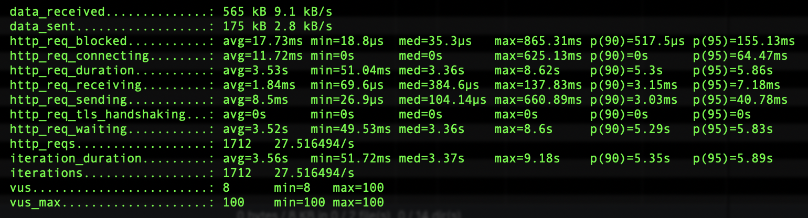

# T1 Test coding

### Install

- `git clone ... & cd ...`
- Ensure that you have Docker locally

That's all...

### Structure

```
codebase/               app codebase files
|-- ...
 
infra/                  infra related stuff
|-- common/             common infra stuff (will be used for all envs)
|   |-- nginx/          proxy's infra stuff
|       |-- conf/       proxy's config files
|           |-- ...
|       |-- Dockerfile  proxy's Dockerfile
|-- local/              local infra stuff (used only for local env)
    |-- postgre/        db's infra stuff
        |-- data/       [CONTENT GIT IGNORED] contains DB files
        |-- init.sql    DB init SQL script
 
load/                   contains load test script
 
postman/                contains postman collection for useful manual testing enpoints
 
docker-compose.yml      project's compose file
 
Dockerfile              app's Dockerfile. Placed here, cause it should has access to the codebase folder
 
README.md
```

### Run

```shell script
docker-compose up --build
```

At first run DB entrypoint will automatically create DB (based on env var) and run [init SQL script](infra/local/postgre/init.sql) (will be mounted at [docker-compose.yml](docker-compose.yml) file).  

Now Nginx proxy watching `http://localhost:8080/` (accepts POST http method only). 
App directly accessible at `http://localhost:8081/` (accepts all http methods).
DB directly accessible at `http://localhost:55432/`.

For manually check accessibility use:
- curl
- Postman (collection attached at [postman/](postman) )

GET request at proxy container fails:
```shell script
$ curl -i http://localhost:8080/
HTTP/1.1 403 Forbidden
Server: nginx
Date: Wed, 04 Nov 2020 20:59:13 GMT
Content-Type: text/html
Content-Length: 146
Connection: keep-alive

<html>
<head><title>403 Forbidden</title></head>
<body>
<center><h1>403 Forbidden</h1></center>
<hr><center>nginx</center>
</body>
</html>
```

POST request at proxy container succeed:
```shell script
$ curl -i -X POST http://localhost:8080/
HTTP/1.1 200 OK
Server: nginx
Date: Wed, 04 Nov 2020 20:59:56 GMT
Content-Type: application/json
Content-Length: 182
Connection: keep-alive

[{"Id":1,"Age":36,"FirstName":"Dima","Username":"demmonico","Email":"demmonico@gmail.com"},{"Id":2,"Age":63,"FirstName":"Amid","Username":"ocinommed","Email":"ocinommed@gmail.com"}]
```

At console meanwhile you can see Go app output:

```shell script
app_go_1     | DB has been successfully connected!
app_go_1     | Cool, we received request
```

Proxy accepts only `POST` http method. It released by:
```
limit_except POST {
    deny all;
}
```
It gives `403` http code. It's better to return `405`, but as far as I found it doable only with `if` statement in Nginx config.
At the same time I know that it's better to avoid `if` statement usage there. 
Thus, since there no requirements regarding response code, I've used `limit_except`, since it's recommended.   

### Benchmarks

For benchmarking use [K6](https://k6.io) and [load/script.js](load/script.js) script. 
You can configure:
- target URL
- virtual users count
- duration

```shell script
docker run --net=host -e TARGET_URL=http://localhost:8080 -i loadimpact/k6 run --vus 100 --duration 60s - < ./load/script.js
```

 

Results (duration 60s, MacBook Pro 2,3 GHz Intel Core i5):

Virtual users|rps|response AVG, ms|response p(95), ms
---|---|---|---
1|24,5|41|62
10|36.8|271|358
100|37.2|2630|4460

Outcomes: 
- more VU - more response time - logically
- the lowest performance (rps) was at 1 VU, supposedly due to the higher load of K6 itself to produce requests 
(response was too fast and there were lost a time while creating new request)
- there was few `http: panic serving 172.23.0.4:39730: pq: could not open file "global/pg_filenode.map": Input/output error` errors
comes around 50th sec, it seems that not all good with my disc system. Nevertheless, it's too much for local load tests at the laptop...  
